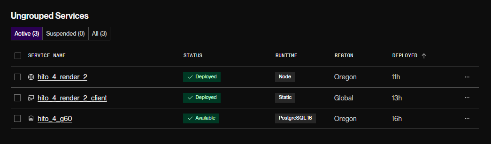
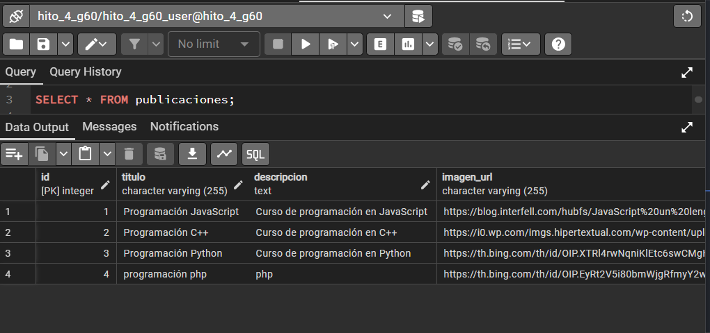
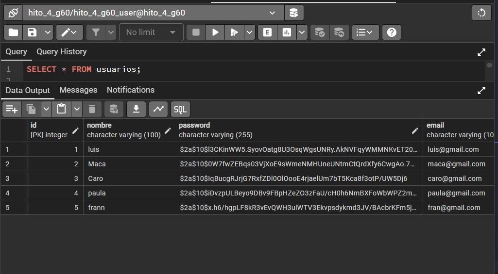

# Hito 4 - Integración y despliegue

## Programado por

#### **Carolina Castillo y Macarena Osses**

## Descripción

Este cuarto hito consiste en la integración y despliegue del proyecto a internet.
Para esto será necesario ocupar plataformas de servicios en la nube como Netlify o Render.
Se deberán probar todas las funcionalidades del proyecto desde la aplicación cliente,
 verificando la persistencia de datos. Posteriormente, se debe confirmar que en el servicio
 elegido para la base de datos online los datos están siendo efectivamente gestionados.
La entrega de este hito será el link en producción de la aplicación cliente.

## Requerimientos

1. Realizar el deploy de la aplicación cliente. 
2. Realizar el deploy de la aplicación backend. 
3. Realizar el deploy de la base de datos 
4. Integrar la aplicación cliente con la aplicación backend en producción. 

## URLs
 - Static site: https://hito-4-render-2-client.onrender.com
 - Web Service: https://hito-4-render-2-78b5.onrender.com/api
 - PostgrsSQL: https://dashboard.render.com/d/dpg-ctfo70lumphs73ec4bkg-a

Servicios activos
 

Base de dato

